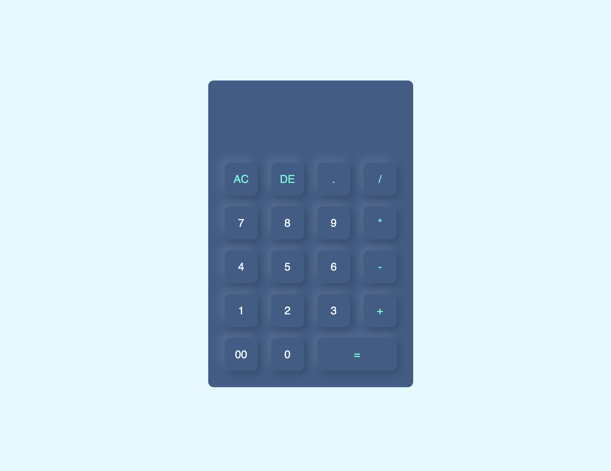

# Calculator App Project

## Description

This is a simple calculator app built using HTML, CSS, and JavaScript. The app allows users to perform basic arithmetic operations, such as addition, subtraction, multiplication, and division.

## Features

- Addition, subtraction, multiplication, and division operations
- Clear button to reset the calculator
- Responsive design, suitable for both desktop and mobile devices

## Technologies Used

- HTML
- CSS
- JavaScript

